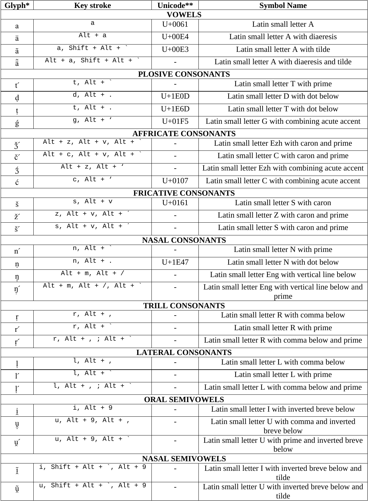

# Slaviature

**Slaviature** is a custom keyboard layout for the Slavistic Phonetic Alphabet. 

For more examples of keystrokes, see the file: [SlaviatureDocs.pdf](keyman/extras/SlaviatureDocs.pdf)

#### This repository contains versions for:

- [Debian/Linux](linux/README.md)
- [Windows](windows/README.md)
- [Keyman (available on Windows, macOS, iOS, Linux and Android)](keyman/README.md)

#### Requirements:

- Fonts such as [Doulos SIL](https://software.sil.org/doulos/) or [Roboto](https://fonts.google.com/specimen/Roboto)

