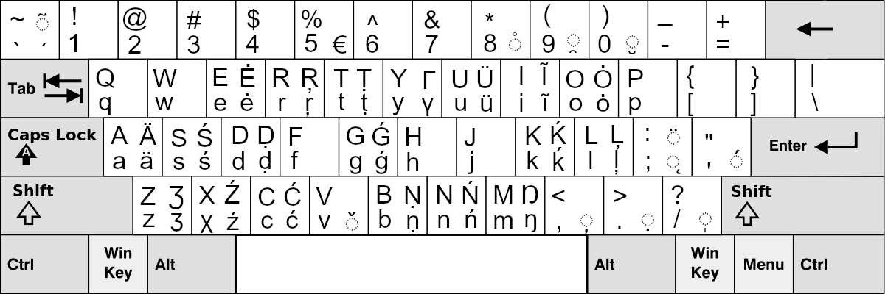
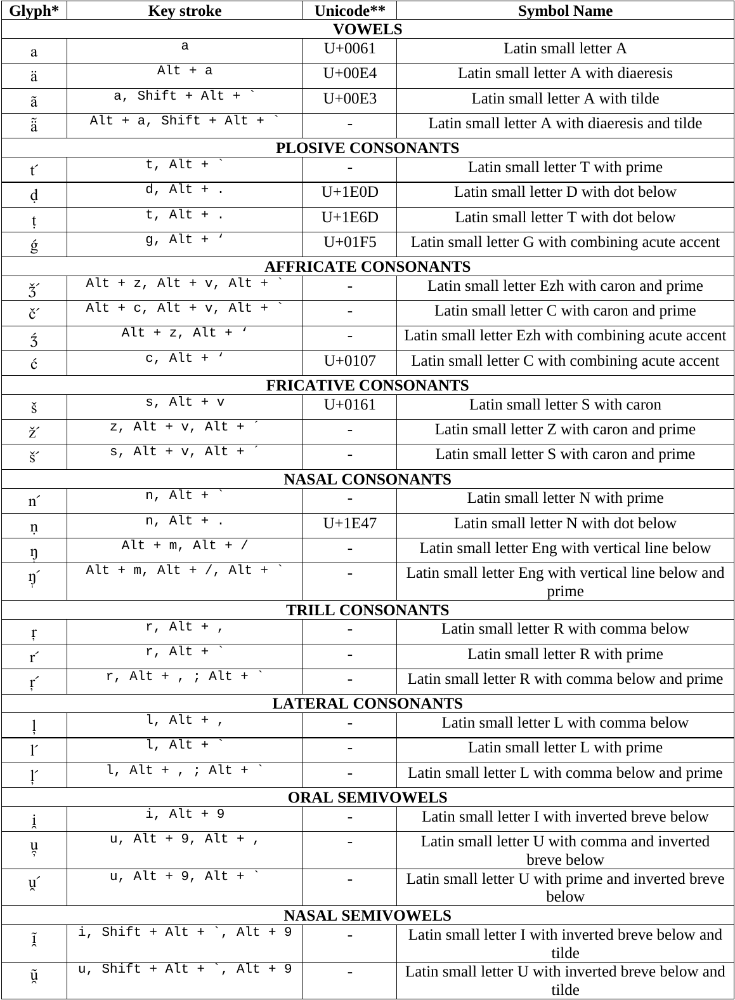

# Slawiatura (ang. *Slaviature*)

**Slawiatura** to układ klawiatury do zapisu slawistycznym alfabetem fonetycznym. 

Więcej przykładów kombinacji klawiszy znajdziesz w pliku: [SlaviatureDocs.pdf](keyman/extras/SlaviatureDocs.pdf)

#### Repozytorium zawiera wersje dla:

- [Debiana/Linuxa](linux/README_pl.md)
- [Windowsa](windows/README_pl.md)
- [Keymana (dostępnego na Windows, macOS, iOS, Linux, Android)](keyman/README_pl.md)

#### Wymagania:

- Czcionki, np. [Doulos SIL](https://software.sil.org/doulos/) lub [Roboto](https://fonts.google.com/specimen/Roboto)
