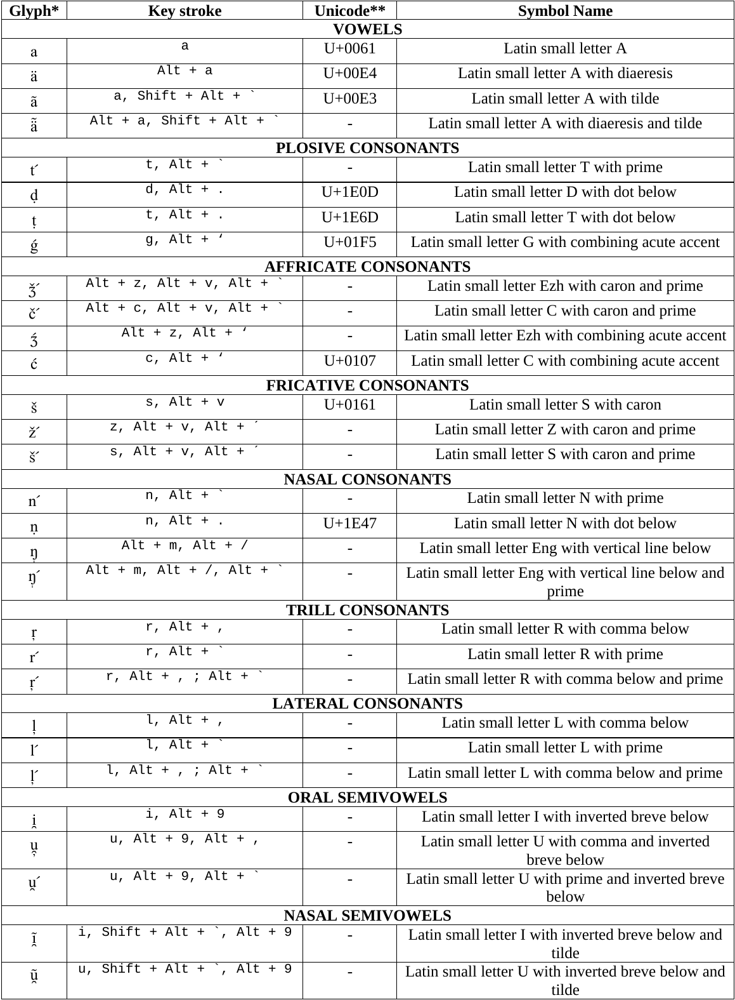

# Slaviature

Slaviature is a custom keyboard layout for the Slavistic Phonetic Alphabet.

Each key can have up to four different characters assigned, arranged
symbolically in the corners of the key:

- Lower left corner — the default character, entered by pressing the key alone.
- Upper left corner — available with `Shift`, usually producing an uppercase
  version of the character shown on the key.
- Lower right corner — available with the right `Alt` key (sometimes labeled as
  AltGr).
- Upper right corner — available with `Shift` and the right `Alt` key.

For example, to type **ä**, press the right `Alt` and `a`. In the documentation,
this is written as `Alt + a`.

To enter a more complex symbol, such as **ã**, first press `a`, then ``Shift + Alt + ` ``
. In the documentation, this is written as ``a, Shift + Alt + ` ``. For an even more
complex symbol **ä̃**  – ``Alt a, Shift + Alt + ` ``. 

The second and third symbols use a diacritic character available on the key with
the ` symbol in the upper-right corner. Slaviature provides eleven diacritic
characters that can be used to compose more complex symbols.

The full list of keyboard combinations is available in the documentation: [SlaviatureDocs.pdf](SlaviatureDocs.pdf)

#### This repository contains versions for:

- [Debian/Linux](linux/README.md)
- [Windows](windows/README.md)
- [Keyman (available on Windows, macOS, iOS, Linux and Android)](keyman/README.md)

#### Requirements:

For the correct display of all alphabet symbols, it is necessary to install an appropriate font, such as [Doulos SIL](https://software.sil.org/doulos/),  [Charis SIL](https://software.sil.org/charis/)  or [Gentium](https://software.sil.org/gentium/)

